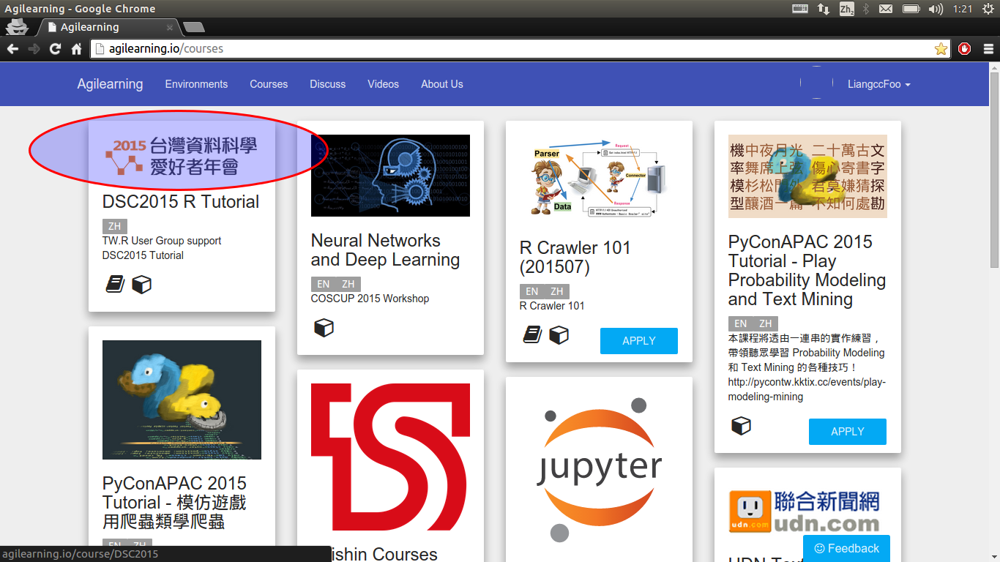
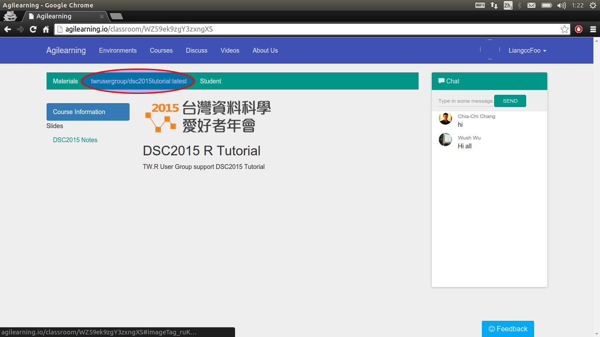
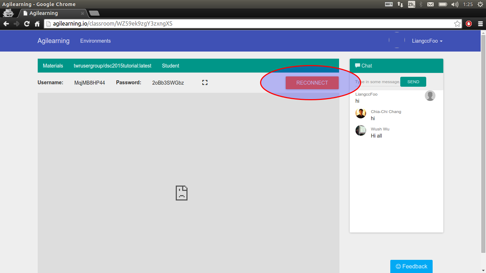
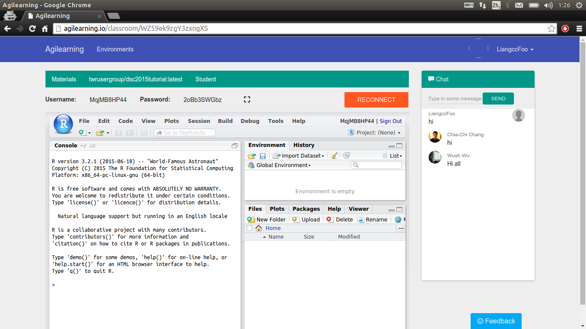

## 平台網址：[agilearning.io](http://agilearning.io)

# 平台使用教學

1. 在信箱中取得平台邀請連結，開啟瀏覽器進入連結。 
1. 可選擇使用Facebook或Meetup登入。登入後點選Agilearning進入首頁。  
1. 進入首頁後，點選台灣資料科學愛好者年會圖案。 
1. 點選join classroom，再點 Go to classroom。
1. 點選twrusergroupdsc2015tutorial:latest。
1. 在Server Group Quota選擇 「DSC 2015 R 語言資料分析上手課程」與[basic ...]，點選Select。
1. 稍候片刻，應有灰色畫面跳出，選擇Reconnect。
1. 輸入使用者名稱密碼，按Sign in。
1. 恭喜您，成為一位快樂的R語言使用者！可以鍵入您的第一個指令：`library(DSC2015R)` 
